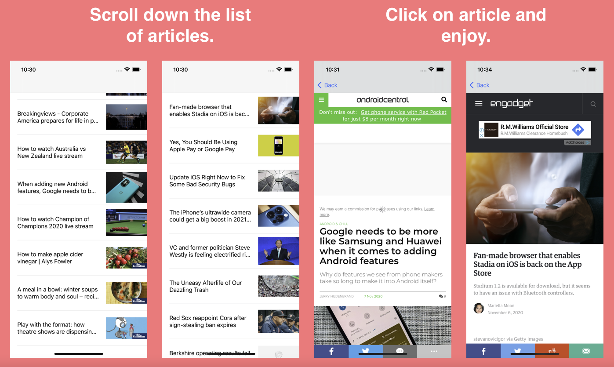

# IzzNews

Top business headlines in the US

## Description

izNews is a simply designed application that retrieves live American News articles straight from the newsapi. On the homepage you get a list of articles with the heading and an image that when clicked opens up another another page with the whole article.

## ScreenShot

## Concepts used to make Application.

- Multiple View Controllers : MVC Design Pattern 
- Working with Applications Programmatic Integration (APIs)
- JSON Parsing the API.
- Using a Cache Manager to store the images sso we dont download them multiple times.

